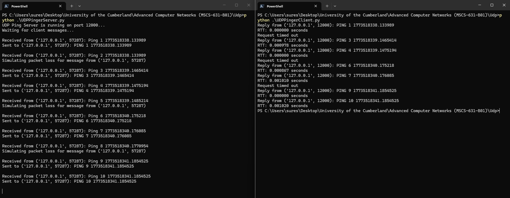

# MSCS-631 UDP Pinginer Lab

**Name:** Suresh Ghimire  
**Course:** MSCS 631 – AAdvanced Computer Networks  
**Professor** Dax Bradely  

## Overview
This project implements a UDP Pinger in Python for the Advanced Computer Networks lab. The client sends 10 ping messages to the server, waits for responses, measures the round-trip time (RTT), and reports packet timeouts when no response is received within 1 second.

The server simulates packet loss, which helps demonstrate the unreliable nature of UDP communication.

## Files
- `UDPPingerClient.py` — client implementation for the lab
- `UDPPingerServer.py` — provided server used for testing
- `README.md` — project documentation
- `udp_server_client_connection.png/` — file containing screenshots for submission

## Requirements
- Python 3.12 or later

No external libraries are required. This project uses only Python standard library modules:
- `socket`
- `time`
- `random` (server only)

## How to Run

### 1. Start the server
Open a terminal and run:

```bash
python UDPPingerServer.py
```

### 2. Run the client
Open another terminal and run:

```bash
python UDPPingerClient.py
```

## Expected Behavior
The client sends 10 ping messages to the server. Because the server randomly drops some packets, the client output should show a mix of:
- successful replies from the server
- measured RTT values
- `Request timed out` messages

## Sample Client Output
```text
Reply from ('127.0.0.1', 12000): PING 1 1773518338.133989
RTT: 0.000000 seconds
Request timed out
Reply from ('127.0.0.1', 12000): PING 3 1773518339.1465414
RTT: 0.000978 seconds
```

## Screenshot Evidence


